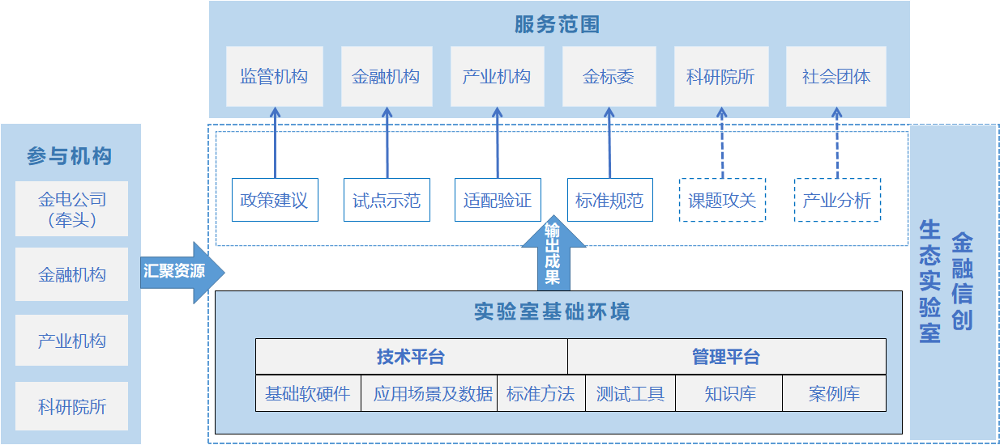
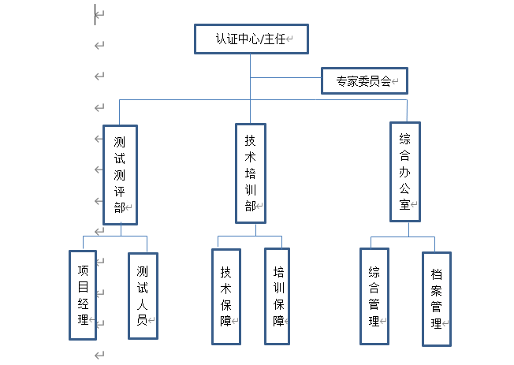
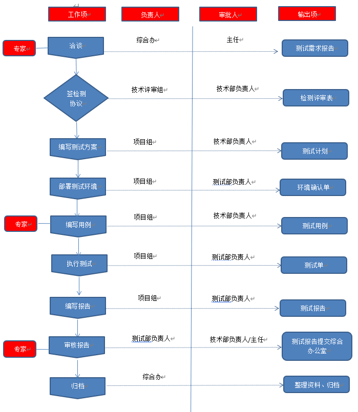

# 信创实验室资料收集

相关国家标准:

GBT 36630.5-2018信息技术产品安全可控评价指标第5部分：通用计算机

GBT 36630.4-2018信息技术产品安全可控评价指标第4部分：中央套件

GBT 36630.3-2018信息技术产品安全可控评价指标第3部分：操作系统

GBT 36630.2-2018信息技术产品安全可控评价指标第2部分：中央处理器

GBT 36630.1-2018信息技术产品安全可控评价指标第1部分：总则

## 一、金融信创实验室

- **背景介绍**

[官方网站](https://www.fitilab.org.cn/%20/home#/home)

金融信创生态实验室（英文名称Financial Information Technology Innovation Ecological Laboratory，以下简称“实验室”）于2020年11月30日，由中国人民银行和北京市相关领导为实验室揭牌。在中国金融电子化集团有限公司牵头下组建，重要金融机构和产业机构合作，金融生态产学研用相关单位参与，遵循“共商、共建、共赢、共享”原则，专注金融信息技术创新的重要基础设施和专业化实验平台。开展了课题研究、技术攻关、行业分析等工作.

​             

实验室坚持目标导向和问题导向，汇聚多方资源，基于国产芯片、操作系统、数据库、中间件等基础软硬件构建的技术底座和技术路线，组织开展各类金融应用与之适配、验证、调优和攻关，降低金融机构和产业机构个别、局部和重复试错成本，解决金融共性问题，形成金融解决方案和实施路径，为金融机构提供可参考、可复制、可推广的指南和示范，为产业机构提供需求对接、产品迭代、技术攻关的机制和平台，并以此促进金融信息技术创新生态的建立和完善。

2020年11月30日，由中国人民银行和北京市支持下，由中国金融电子化集团有限公司牵头组建，当前，在北京有三个办公场地。

运营收益：主要来源于承担课题研究、提供测试环境收费、开具适配验证报告收费，政策建议服务收费、标准规范制定、贯标等。

同时，纵观金融信创生态实验室的发展，其在技术、生态、人才等方面取得一定进展。

目前，金融信创生态实验室建成“1+N”的体系，增强其在适配验证、技术攻关和标准制定方面的整体能力，联合产业供给侧和金融需求侧，加速生态建设。

技术层面，金融信创生态实验室基于国产芯片、操作系统、数据库、中间件等基础软硬件构建的技术底座和技术路线，组织开展各类金融应用与之适配、验证、调优和攻关，降低金融机构和产业机构个别、局部和重复试错成本，形成金融解决方案和实施路径，为金融机构、产业机构范围，促进金融信息技术创新生态的建立、完善。

人才方面，金融信创生态实验室与产业各方合作，加快对人才的培养。目前，已经结合线上线下，完成了3期培训，围绕芯片、操作系统、中间件、数据库、云与虚拟化、安全、网络、存储、集成、金融机具、外设、办公业务、一般应业务、核心业务等多个领域，为银行、保险、证券等多家机构提供人才培训。

- 相关机构:北京银行信创生态实验室

- **北京银行-北京鲲鹏联合创新中心“北京银行信创生态实验室”正式揭牌**

  2020年8月21日，北京鲲鹏联合创新中心举行了北京银行信创生态实验室挂牌仪式。

  为了加快计算机产业的国产化生态的发展，北京银行与北京鲲鹏联合创新中心携手前行，共同建设鲲鹏生态。双方将通过北京银行信创生态实验室展开联合创新、技术支持、标准制定、测试认证、人才培训等合作，共打造鲲鹏计算新生态。

  北京银行信创生态实验室未来主要解决数字化转型中遇到的难点、痛点，在大数据、人工智能等领域孵化出有建设性的方案。信创生态实验室将汇聚行业伙伴，认准新技术领域和前沿技术，打造生态合作赋能新模式，推动协同共赢的新发展。未来，银行数字化发展也将逐步从个人消费金融领域逐步扩散至产业金融领域，依托产业[互联网](http://jingzhi.funds.hexun.com/160636.shtml)的快速发展，基于线上线下各类数据的分析应用，产业[互联网金融](http://iof.hexun.com/index.html)也将迎来新的机遇与空间。

- **相关成绩**
  1. 评审、推广、发布行业优秀解决方案，[链接](https://www.01caijing.com/article/333558.htm)

### 1.1 实验室定位

金融信创生态实验室汇聚金电公司、金融机构、产业机构和科研院所等多方资源，基于基础软硬件构建多个技术底座和多条技术路线，组织开展各类金融应用与之适配、验证、调优和攻关，降低金融机构和产业机构个别、局部和重复试错成本，解决金融共性问题，致力于搭建“共赢桥”，构建“适配库”和打造“孵化器”。

实验室作为金融行业信息技术创新的基础设施，建成“1+N”的实验室体系，增强实验室在适配验证、技术攻关和标准制定方面的整体能力，打造生态实验室品牌，联合产业供给侧和金融需求侧，加速生态建设，搭建产金“共赢桥”。

围绕金融业务类任务，以芯片+操作系统为技术底座，积累金融典型业务场景，收集相关产品版本，配备各式测试工具，总结多种技术适配路线，逐步形成“适配库” 。

收集金融机构和产业机构相关问题，联合攻关，促进成果转化，培养创新领军人才，助力产品创新，打造中国金融解决方案，形成应用完善、产品创新、技术升级和方案输出“孵化器”。

### 1.2 运行机制

整体运行分为两条路线，分别如下：

路线一：主要是进行适配、调优、验证，形成对应技术解决方案，侧重安全可控。

路线二：针对重点问题进行攻关，形成对应解决方案，侧重创新发展。

通过两条路线的推进，最终在金融业务场景进行验证，形成金融行业解决方案。

### 1.3 软硬件资源

目前实验室已初步形成“1+N”架构，机房容量共计2500个计算节点，部署于三个场地，具体情况如下所示：

地址一：金融信创生态实验室（石景山，建设中）办公面积约3000平方米，机房容量约2000个计算节点。

地址二：金融信创生态实验室（公主坟），办公面积约800平方米，机房容量约360个计算节点；

地址三：金融信创生态实验室（酒仙桥）办公面积约1000平方米，机房容量约140个计算节点。

 

实验室可选基础设施&技术路线

1.硬件设备

芯片：鲲鹏、飞腾、海光、兆芯、龙芯、申威

服务器：曙光、浪潮、清华同方、706所……

网络设备：华为、锐捷、迈普……

存储备份：华为、同有……

打印机：奔图、立思辰……

2.基础软件

操作系统：麒麟、统信 

数据库：武汉达梦、人大金仓……

中间件：金蝶天燕、东方通、宝兰德……

虚拟化&云平台：华为、腾讯、航天云宏……

3.应用软件

OA系统：泛微、慧点、蓝凌……

流版签：金山、永中……

## 二、国家适配认证中心

- **背景介绍**

2021年底全面投入运营，已向龙芯中科、天津飞腾、华为、上海申威等企业提供免费的芯片适配服务。
  、从北京经开区国家信创园获悉，由工信部和北京市推动建设的信创领域通用软硬件适配认证中心（简称国家适配认证中心）已完成部分装修工作并投入使用，已向龙芯中科、天津飞腾、华为、上海申威等企业提供免费的芯片适配服务。该中心预计年底前全面投入运营，以打造成为国内领先的信创领域攻关适配公共支撑和应用创新样板区。

　建立国家适配认证中心，是工信部和北京市贯彻落实总体国家安全观，加快推进国产自主可控替代计划，构建安全可控的信息技术体系的重要落脚点。据介绍，国家适配认证中心通过统一适配标准、统一测评体系、统一生态服务，建设公共适配支撑平台，完善适配生态体系，打造国内领先的信创领域攻关适配公共支撑和应用创新样板区，对统筹产品认证适配和技术诊断测试、推进联合攻关和协同创新、激发创新动力和创新活力发挥战略性、支撑性、引领性作用。
[详细信息]:http://www.jjckb.cn/2021-03/18/c_139818416.htm

- **主要职责**

	国家适配认证中心承担着六大职能：
	1. 建立和规范生态合作体系，积极推动生态适配与生态合作业务开展；
	2. 建立整机适配服务中心，实现整机云、CPU、板卡部件的适配；建立应用及外设适配中心，实现应用、外设与应用方案适配；
	3. 建立统一测评体系，依据标准规范进行系统测评工作，保证适配兼容性要求；
	4. 建立生态服务体系，完善技术服务及服务规范要求，为合作伙伴和最终用户提供完善的生态服务保障；
	5. 制定统一的认证管理体系，加强认证规范并提升生态质量管理能力。

- **业务发展路线**

	国家适配认证中心整体规划了“1+6”业务发展路线，即集约化、专业化的“一个适配中心”策略，多维度、多领域的“六个支撑平台”形式，包括
	1. 综合业务运营平台
	2. 应用软件适配平台
	3. 应用方案联合适配平台
	4. 外设板卡适配平台
	5. CPU整机适配平台
	6. 适配中心办公平台.
	以此共同实现对产品的适配、验证、运营以及生态伙伴信息库、资源库、知识库、生态成果库、方案库的统一规划管理。

## 三、国网四川电力信创实验室

​		国网四川信通公司12月3日透露，国网四川省电力公司协同中科曙光通过线上举行了信创联合实验室揭牌仪式，信创联合实验室正式成立。

　　据了解，为积极落实国家有关部门及国网公司关于桌面终端信创工作要求，按照“试点先行、先易后难”工作原则，围绕“充分验证、集中突破、稳妥推进”思路，以“一联合、两共享”工作机制(成立信创联合实验室；总部、省(市)两级成果共享机制)，全面推动国产信创终端“真替真用”、“好用愿用”。

​		此外，信创联合实验室组建了专业团队，以国网四川信通公司、国网四川电科院、信创核心技术支撑单位为中心，地市供电单位、系统厂商共同参与，并邀请政府网信办、经信厅、公安厅，高校、企业信创专家共同组成特聘专家团队。重点围绕研究终端替代、系统改造、外设适配的思路与解决方法，形成调研、测试、适配、推广、培训、改进完善等闭环工作流程，持续不断输出典型场景解决方案，建立总部、省(市)两级共享机制，推出信创终端试点推广指导意见，为后期信创终端规模化应用注入强大动力。

据统计，国网四川电力当前在用业务系统超过200套，电力系统终端信息技术应用创新的全面适配迁移面临业务系统数量多、场景复杂、资源协调任务繁琐等多方面挑战。为扎实做好业务系统适配迁移工作，双方共同投入，通过顶层设计，以联合实验室为抓手统筹国网四川公司适配事宜。

信创联合实验室以生态适配、网安检测及解决方案为三个主要的功能定位，形成调研、测试、适配、推广、培训、改进完善等闭环工作流程，持续不断输出典型场景解决方案。

## 四、江苏信创网络安全关键技术联合实验室

为贯彻党中央、国务院关于网络安全相关决策部署，促进信创产业和信息安全事业的发展，2022年6月22日，由工业和信息化部网络安全产业发展中心（工业和信息化部信息中心）与江苏省信息技术应用创新攻关基地联合共建的信创网络安全关键技术联合实验室在无锡高新区（新吴区）国家软件园天鹅座进行隆重的揭牌仪式。

工信部网络安全产业发展中心（信息中心）付京波主任、省工信厅池宇副厅长出席了揭牌仪式，会上无锡市政府办二级巡视员周浩明作了殷切寄语，希望江苏省信创攻关基地一如既往地贯彻落实市委市政府、无锡市信创发展工作推进小组的工作指示，加快信创网络安全领域相关标准的编制以及关键技术的联合攻关。高新区党工委书记、新吴区委书记崔荣国对于高新区信创发展工作以及江苏省信创攻关基地现阶段取得成绩做了充分的肯定。

随着本次揭牌仪式的圆满结束，工业和信息化部网络安全产业发展中心与江苏省信息技术应用创新攻关基地共建的信创网络安全关键技术联合实验室也宣布正式落成。今后双方将充分发挥各自优势，加强技术合作，形成优势集成与互补，通过技术与产业合作，编制一批信创领域安全技术相关标准规范；研究一批信创网络安全关键技术；研制一批面向信创领域典型应用场景的解决方案并适配验证；在政府支持下共同推动信创网络安全人才培养相关工作。
未来双方将携手共进，共同推进信创领域新技术研发创新与网络安全高质量发展，为国家构建网络安全可控体系、为江苏省打造信创产业强链贡献积极力量！

## 五、厦门信创融合实验室

厦门日报讯（记者 陈璐 通讯员 雷飏）昨日下午，由工信部协同攻关和体验推广中心(厦门)主办的“产教融合战略合作签约暨信创融合实验室建设启动仪式”在软件园一期举行。

在火炬高新区管委会的协调和推动下，活动以“协调联动 共谋发展”为主题，以推动信息技术应用创新为主攻方向。在与会领导、专家与厂商代表的见证下，厦门理工学院软件工程学院、麒麟软件有限公司、厦门威特科技有限公司签署产教融合战略合作协议，开启“信创融合实验室”建设序幕。

“信创融合实验室”本着服务国家产教融合重大战略需求，依托工信部协同攻关和体验推广中心(厦门)，深入开展产教融合协同育人改革实践。

“发挥信创代表企业和厦门理工学院在各自领域的优势，信创融合实验室以人才培养为方向，将针对在校学生开展定制的培养计划，包括课程、项目实训等方面，通过产学研的深度融合，精准培育信创人才。” 工信部协同攻关和体验推广中心(厦门)负责人张旭说。

据介绍， 厦门威特科技有限公司是一家从事软件开发、系统集成、平台运营的科技公司，其自主研发的“零壹桥”信创系统兼容平台在信创工程和信创融合实验室中具有自身独特的优势、作用，该平台入选工业和信息化部网络安全产业发展中心“2021年度信息技术应用创新典型解决方案”、福建省数字福建建设领导小组办公室“2021年度福建省信息技术应用创新典型解决方案”，是国内首创并保持领先的产品，目前已开始在金融、交通、能源等行业推广应用。

值得一提的是，厦门市发改委、厦门市审计局采用“零壹桥”信创系统兼容平台，率先实现整建制终端“真替真用”单轨化运行的目标。

## 六、天津海河实验室

围绕物质绿色创造与制造、先进计算与关键软件（信创）、现代中医药、合成生物、细胞生态等重点领域，“十四五”期间，**天津将对标国家[实验室建设](http://www.labbuild.cn/tag/实验室建设)海河实验室。**

“十四五”开局之年，为全力推动重大科研设施和创新平台建设，近日印发的《天津市科技创新“十四五”规划》明确提出筹建海河实验室。天津将对标国家[实验室建设](http://www.labbuild.cn/)海河实验室，并根据国家实验室布局情况和实际工作进行推动，通过推进学科交叉融合，完善共性基础技术供给体系，打造自主创新和原始创新的核心支点；通过推进产学研深度融合，提升科技成果转化效能，打造引领新兴产业发展的重要源头；通过促进各类创新要素聚集，优化配置科研力量，建设科技资源共享的开放平台；通过完善科技评价机制，扩大科研自主权，探索科技体制机制改革的全新范式。

天津市科技局副局长袁鹰介绍，目前，围绕海河实验室建设、运行各项制度机制已基本成型。在人才团队方面，海河实验室已明确5位院士担任实验室主任和牵头人，30余位两院院士、近百名国家杰青等高层次人才已同意加入实验室项目团队，近3000名专业技术和技能型人才也正在加快聚集；在平台载体方面，15万平方米实验室首期研发平台和5万平方米配套设施正在加快建设；在优质资源方面，海河实验室积极对接，汇聚知名高校、科研院所、龙头企业等优质创新资源，已有近30家国家级科研院所、重点高校和龙头企业深度介入海河实验室建设，为实验室高标准建设提供了有力资源保障。

## 七、运营商信创生态联合实验室

2020年初，中国联通信息技术应用创新联合实验室率先建立，并已在广东、浙江、青海、湖南、贵州、吉林、黑龙江等7省建立信创攻关分基地。

2021年6月8日，浙江移动信创适配基地暨信创示范营业厅在金华正式建成启用。

2021年6月28日下午，“中国电信上海信创基地”正式揭牌。

2021年6月，中国移动拟成立生态实验室。

运营商以“ 信创 实验室 ”为载体，提升技术支撑保障能力，推进办公系统在国产技术环境中的迁移适配，积极开展一般业务系统乃至部分关键业务系统的测试，现已有标杆性的信创改造案例落地。

以联通为例，全资子公司联通数科牵头成立 **“中国联通信息技术应用创新联合实验室”**。实验室联合生态伙伴结合通信业务发展的实际需求开展信创信息系统建设，形成了经过实际项目验证的、切实可行的、 成熟 的信息技术国产化替代解决方案并成功推向信创领域。

除此之外，实验室还对联通集团260余个业务应用系统进行了“卡脖子”风险定级，针对271个高风险、222个中风险事项逐一制定了应对方案，完成了离退休老干部系统、随沃行、新沃云、沃云集成研发平台、智能运营平台等自主产品的国产化适配验证工作，形成了一系列运营商业务场景下的国产化解决方案；打造了面向党政行业、标准化的《信创方案》和信创实施交付工具。 为 推进核心自主可控技术在电信业的应用、开启 通信行业信创 全面国产化 新纪元助力 。

## 八、四川省信创联合重点实验室

[官方网站]:https://it.sicnu.edu.cn/p/0/

四川省信创联合重点实验室是四川省集约化保障中心（川发展控股的四川省自主可控电子信息产业有限公司）与四川师范大学联合于2020年12月成立。在国家发展自主可控产业解决一系列“卡脖子”工程的重要背景下，依托四川师范大学数学与信息计算科学、计算机软件等交叉学科与人才优势，面向四川自主可控电子信息产业发展，以数学模型、信息计算、软件开发为核心内容，旨在建设高水平交叉学科与技术研发平台，培育孵化可市场转化的信息技术、软硬件系统及产品等成果，以及面向信创产业人才需求，建设产教研融合模式的人才培训支撑体系。

四川省信创联合重点实验室现有场地1000余平米，用于软硬件适配500平米， 信创生态展场300平米，软件研发、专家工作室220平米，2020年新购龙芯、鲲鹏、 飞腾芯片国产服务器、终端等设备200余万元。重点实验室现有正高级（教授、软件架构师、教授级高工）6人，副高级（副教授、高级工程师、安全工程师）10人，以及在校硕士博士生20余人，已建成了承担国家重大项目的科技攻关团队；此外，还专门聘请了具有丰富软件工程与实践能力的核心技术人才，并与成都本地多家软件公司建立了紧密合作关系，具有强大的对外承接外包软件开发和服务能力。

#### 一、组织架构

四川省信创重点实验室下设国产化教育软件适配认证中心（以下简称：中心）旨在为教育行业软件的国产化提供适配及其迁移的解决方案，为其国产化提供应用测评的认证环境。为满足适配认证工作的需要，中心下设测试测评部、技术培训部、综合办公室三个部门。

 

**一、****中心机构设置及其岗位职责**

（一）主任

   全面负责认证中心整体管理，保证中心各项工作始终遵循认可准则，维护管理体系，确保其持续改进；落实检测资源，保持检测能力；具有中心的最高决策权和否决权；确保建立内部沟通机制，并就与管理体系有效性的事宜进行沟通；监督改进、预防及纠正措施的实施情况；

（二）测试测评部

按照检测协议或者合同，完成下达的检测任务；负责项目的具体认证工作；组织本部门设施和环境的监控；负责接收和保管客户移交的样品和资料，组织本部门开展设备的送检（较）、维护和期间核查；参与合同的评审；选择和确认本部门的检测方法；负责样品在本部门保管期间的安全；负责测评按标准或规程（规范）实施检测工作；跟踪检测标准更新动态，确保其现行有效；组织编制作业指导书；负责新项目筹备，参加新项目评审；参与合同评审；组织实施设备维护、期间核查、能力验证和比对以及为保证检测结果质量的监控工作； 

（三）技术培训部

负责协助主任开展技术适配基地的整体管理，保证基地各项工作始终遵循认可准则、检验检测机构资质认定评审准则，维护管理体系，确保其持续改进。

负责建立完整的、合规的实验室体系，负责报告审核、实验室整体测试测评质量的运行管理；参加管理评审，有权直接向最高管理者报告管理体系存在的问题；对检测任务的整体质量进行把关；参与所有测试项目过程数据、成果数据等所有资料报告的评审；组织所有测试项目的投诉和事故的处理；配合测试测评部等其他部门开展测试测评工作。

负责开展中心管理人员的专业技术培训，撰写中心培训、培养计划；负责相关专业学生的招聘、遴选和培养工作，为中心培养专业技术后备人员。

（四）综合办公室

负责管理体系的编写、宣贯和有效运行，实施质量评审活动，管理基地的资料（档案、体系文件、技术资料）；负责客户服务的管理，接待来访客户，与客户签立常规检测合同或协议；管理检测报告；受理客户投诉；向客户发放检测报告；负责固定资产管理和消耗性材料的采购、管理；协助组织重大合同的评审；负责收集、保管、发放文件资料，维护资料、文件、档案的有效性和完整性。负责保管涉密物品及技术文件，履行其在中心的保密责任。

#### 二、发展方向与重点项目

（一）国产化软件迁移、适配技术及应用

1、软件开发与测试—国产化平台下的适配和迁移 

2、基于国产教育装备的信息技术教学示范基地建设与教学研究

3、基于国产信息技术的信息安全体系设计与系统集成

（二）新一代信息与智能技术研发及应用

1、基于智能云的数学复用工具软件关键技术研究 

2、新一代人工智能轨道交通智慧车站

3、面向智能应用的量子通信模型与算法

4、教育智能平台与教学行为智能识别系统

5、城市工业园区风险量化研判与智能预警系统设计

（三）信创领域人才技能培训支撑体系

1、基于国产化信息技术的教学课程改革研究与实践

2、基于国产软硬件平台培养高精尖人才专业实践能力建设

3、信创人才评价认证考试培训基地

4、国产操作系统师资培训与认证 

5、信息与计算科学专业实习实训基地建设 

在当前IT技术日新月异，交叉学科深度融合发展的时代，在基于国家发展需要的新时代背景下，四川省信创联合重点实验室以创新研究、创新管理、服务产业为抓手，坚持以市场应用为牵引，项目为驱动力，外引内拓，正在朝气蓬勃打造新时代产学研一体化服务平台。

#### 三、适配流程

****

### 8.1 四川信创教育行业联盟

四川信息技术应用创新产业联盟教育行业分会（以下简称信创教育行业分会），是省委省政府推动自主可控信息技术产业发展的省级产业联盟，在四川省教育厅、四川省经信厅行业的管理和指导下，为教育行业行政主管机构做好支撑和智库服务，为教育信创行业企业做产学研平台服务，促进教育行业信创工程落地，加快各类学校信息化建设与信创人才培养，推动教育行业信创产业发展，服务地方经济教育文化发展为宗旨的社会团体组织。

信创教育分会设立在具有“教师摇篮”之称的四川师范大学狮子山校区，这里也是我省举办本科师范教育最早、师范类院校中办学历史最为悠久的大学，70余年来的沉淀已经成为引领区域教育发展的国内知名大学。信创教育分会将进一步发挥师大人才培养、科技研发与社会服务的历史责任，在上级部门的领导与指导下，认真履行分会章程，竭诚为会员单位服务，让我们共同开拓教育行业信创新天地。

### 8.2 技术团队

- 资深专家顾问
- 学术委员会
- 技术专家团队

### 8.3开展的活动

1. 政府采购供应链信创高峰论坛
   近年来，信创产业发展不断深入，国产基础软硬件能力稳步提升，我国自主信息技术生态体系初见雏形，应用牵引是未来产业发展的关键，需进一步加快产学研各方联合，助力信创底层技术攻关研究；健全产品评价机制，加强产品供给侧与用户需求侧对接；加强行业交流，构建良性产业发展生态。

### 8.4 相关业务

1. 信创运维培训

   一、培养目标

     面向信息技术应用创新产业从业者。通过本次培训的合格人员能熟练、安全地安装和配置相关设备；能正确描述信息系统运行中出现的异常情况，具备一定的问题受理和故障排除能力，能处理信息系统运维中出现的常见问题，保障设备、业务系统的正常运行，实现运维管理和信息安全；具有工程师的实际工作能力和业务水平。

   二、培训对象

   1、各单位信息化工作相关管理人员、技术骨干。

   2、集成商、应用开发商、产品厂商负责信创工作的管理人员、业务/项目经理、售前、技术交付的业务骨干、运维人员等相关信创工作从业人员。

   3、相关专业的教师和在校生。

   4、其他具有一定信创从业经验，希望得到进一步全面系统提升的人员等。

   三、培训内容

   （1）熟悉信息技术服务和运维服务管理标准、国家信创政策知识；

   （2）掌握运维服务的需求分析和管理；

   （3）了解运维服务的规划设计；

   （4）熟悉运维服务的管理流程；

   （5）熟悉信息系统的运维，针对运行中的问题，能够提出解决办法与改进措施；

   （6）熟悉运维硬件技术，如服务器、存储设备、网络设备等；

   （7）掌握操作系统、数据库系统、计算机网络的基础知识，熟悉运维软件；

   （8）掌握运维中的故障分析与诊断的方法；

   （9）熟悉数据中心、云平台、业务系统等的运维方案与实践；

2. 信创开发

   一、培养目标

     为了提高本科生和研究生的学习积极性和主动性，增强并扩展学生综合素质和能力，促进学生的全面发展和个性发展，力求达到学生“以点带面，逐步提高”的目的。通过项目驱动的方式，使学生扩展知识面，提前提高知识储备，挖掘学生的动力与潜力。

   二、培训对象

   未来想从事计算机软件、算法、机器学习等相关领域的本科生和研究生。

   三、培训内容

   1、Java语言的算法基础、常用数据结构、编程规范；

   2、Java面向对象程序设计，基础设计模式；

   3、Java面向对象编程基本实现及原理

   4、面向对象的基本原则以及在编程实践中的意义；

   5、常见的数据结构和实用算法；

   6、Python编程开发

   7、机器学习理论课程

   8、机器学习算法设计与实现

3. UI设计师

   一．培养目标

   UI设计工程师是互联网时代软件产品研发中不可缺少的一种专业研发角色。从狭义上讲，UI设计工程师使用平面设计软件、HTML、CSS、JavaScript 等专业技能和工具将产品进行UI设计，从广义上来讲，所有用户终端产品与视觉和交互有关的部分，都是UI设计工程师的专业领域。

   二．培训对象

   具备美学基础的信息化工作相关技术人员、技术骨干。

   三．培训内容

   洞察行业发展趋势，精通平面设计知识，熟练使用AI、PS等平面设计工具，掌握前端HTML+CSS+CSS3基础知识，具备将UI设计转化成软件前端UI界面的能力。

## 九、湖南长沙信创产业协同适配中心

1月11日，湖南省信创产业协同适配中心暨“国家网络安全产业园区（长沙）信创产业协同适配中心”正式启动。这意味着通过生态单品适配、集成调优及测试、生态体系图谱构建等，更好地打造统一且丰富的产业生态，并加快建设湖南特色“两芯一生态”的信创产业模式。

   信创产业协同适配中心位于长沙市高新区中电软件园，由麒麟软件牵头共建并负责实际运营。该中心面积近1000平方米，投入资金约500万元。该适配中心共搭建了包括支持现场适配的物理环境以及远程适配的云环境等各类外设适配和测试环境，并按照生态分类、应用分层分级模式，设立了首席专家、总指挥及副总指挥等指挥线，可全面实现深度合作并全面提供优质解决方案。

   目前，银河麒麟操作系统V10已完成一个版本，可同时支持基于飞腾和鲲鹏CPU的整机设备。中心将着力于与国内各大应用软件、云平台和大数据等领域开展兼容适配和互认证工作，已完成与近2000余款软硬件产品的互认证。

   据悉，未来将整合多方力量和政产学研资源，开展核心技术联合攻关、软硬件适配认证和应用示范推广等，形成产学研用一体化的系统性综合产业生态集群。一方面服务于党政机关、企事业单位及金融、教育、能源、医疗、交通等行业的国产化升级工程，另一方面推动基于国产基础软硬件的产业从“能用”向“好用”“愿用”转变，并最终形成“湖南特色、全国最大”的国产信创产业生态圈，全面助推区域产业发展和网络强国建设。
