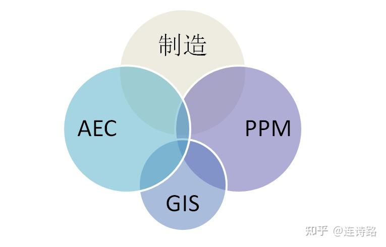
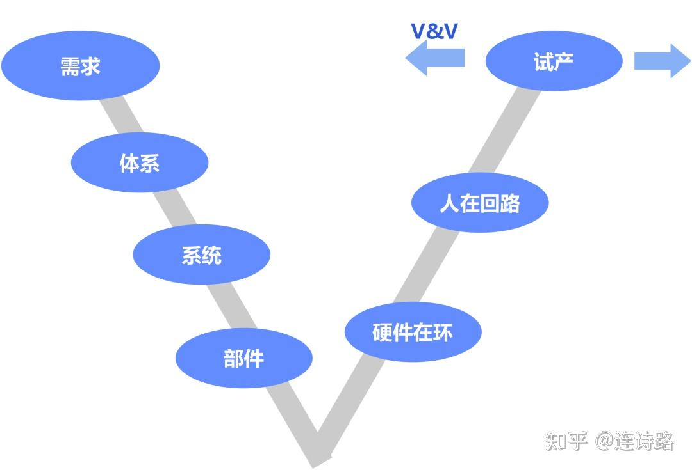
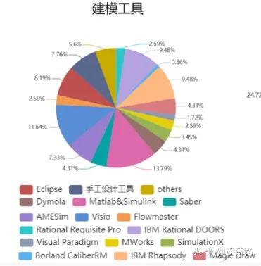

# 工业软件 无尽的前沿

工业软件是数字化转型的落脚 

**概念之槌，如何举起来**

那么，工业软件到底应该是一个什么样的范畴？

回答起来很难。没有人能够完全梳理清楚工业软件的问题，每一种国民经济分类的背后，都有着一大堆的工业软件的筋脉相连。正因为如此复杂，使得在攻坚战打响的时候，很难给出一个完整、清晰的边界。这是一头巨象，每人都只能摸到局部一点点。

工业软件的定义一向宽泛，在中国也是歧义很多。一种常见的看法是，只要是在工业活动中使用的软件，都可以算在其中。这意味着工业软件的范畴，很难有一个纯种的血统。但这种泛化的认识，容易混淆工业软件之间的差异。可以说， 像Oracle、Salesforce这样的软件巨头，尽管很难替代，但如果下狠心，正如银行领域的去IOE一样，两年不行，五年总可以，总是有办法的。这是一个靠决心和狠心可以短时间生效的问题，我们已经看到华为、阿里无论是服务器还是数据库，正在起到的作用。但想要替代类似像ANSYS、Synopsys这类的大型工业软件，靠瞬间的决心和狠心，是没有可能的。即使是乐观一点，十年八年恐怕都很难。

这让我们意识到，工业软件的定义界面不能太宽泛。因为太大的突击面，即使投下去资金和努力，但收效仍然会很差。小小的按钉，会让我们简明扼要地了解到，相同的压力，也只有在更小的面积上，才能产生破除障碍的效果。中国的工业软件，只有收缩并聚焦受力面，才能产生更大的突破性效果。

按美国咨询公司IHS的软件分类，大类别有18种。其中跟中国的工业软件最接近的，就是“工程和科学软件”，用来支持工业和项目活动的工程和科学过程。按照该数据库统计，大概有5000多家软件工业软件供应商，提供了近2万多种不同的工业软件。而实际上，大量的工业软件并不在收录之中，因此实际数目要远大于此。

在中国，“工程和科学”都有特别的含义，因此这种概念也无法对照过来。理想中的工业软件，最好能跟机器、工艺、材料等紧密结合在一起。在这里，笔者给出一个大类，将工业软件可以分为工业管理学和工业物理学。这样的分法，纯粹是为了将管理类的软件区分开来，同时还能保留工程科学计算的血统。这里的“物理学”，并非狭义“物理学科的科学”，而是指“物理实体的科学规律”，因此也包括化学、生物学等。本文主要就是来讨论这一类软件，而ERP软件、供应链软件SCM、客户关系管理等工业管理类软件，就不再作为本文的讨论对象。

在推动美国制造业发展的历史进程中，美国学者也曾经对“制造”的定义有过困惑。后来有一种定义认为，“掉下去能砸到脚的东西，那就是制造”，尽管这种定义也不够准确，但它非常形象地描述了“实体经济”如粗眉大眼般的活生生气息。而“工业物理软件”，也希望起到这样一种区分的作用，尽管笔者给不出类似“砸到脚”这种传神的比喻。

图1 工业软件全景图示意

工业物理学软件，可以按照企业的业务流程进行分解。大致可以分为厂房设计，产品研发设计（包括实验室）、制造过程和产品服务等四大过程。

产品服务往往与嵌入式软件有密切关系。嵌入式软件，是跟终端设备密切捆绑的一类软件，随着产品一起销售出去。随着智能产品快速发展，机械产品与电子设备的融合越来越强，因此嵌入式软件也是高速增长。根据《前瞻研究院》的数据，2019年中国嵌入式软件市场规模接近100亿。就销售额而言，华为、海尔、南瑞集团、中车等都是领头羊。这类软件，行业跨度很大，而且已经跟机电液压等融合在一起，因此并非独立销售的产品。很多自动化产品也都有大量的与硬件相捆绑的嵌入式软件，这类产品被称为嵌入式系统。像制造业最常见的控制系统PLC，其实就是一个嵌入式系统。在这其中，嵌入式操作系统最引人注目，消费者对安卓、苹果手机操作系统已经很熟悉，而在工业领域则主要是美国风河的VxWorks，以及加拿大的QNX，也有开源的Linux系统可以支撑，国内则有北京翼辉的 SylixOS等。跟消费者级的操作系统最大的不同是，它需要很强的实时性、可靠性和对恶劣环境的适应性。操作系统之下是硬件，上面是中间件和应用软件。应用软件跟行业密切相关，也最丰富多彩。风河的起家，就是跟美国宇航局NASA密切相关，并逐渐渗透到到军工、网络通信、工业控制等领域。随着边缘计算和泛在连接的发展，嵌入式操作系统可以更好地实现边缘智能和机器端决策。嵌入式软件是高端装备的重要组成部分。全球最大的军火商洛克希德马丁有时也被看成是工业软件巨头，就是因为它的军机、导弹等，也带有大量的嵌入式软件。但对外单独出售成熟软件，却并不是他们这类企业的商业模式。因此从独立性和商业性的角度出发，嵌入式软件也不作为本书的研究对象。而开发汽车、家电、医疗器械等产品的嵌入式软件的时候，仍然需要大量的研发工具软件，则是我们的重点。

这张《工业软件全景示意图》，肯定会遭到不少人的质疑。因为要在一张图上，既反映出工业软件的全貌，又要做到科学性，真的是太难了。就像在北京这座千年古都中观光旅游，如果要用两日游就完成旅途，那只能是个别看实景大部分靠地图，仅仅收获一个大致印象，和些许的历史牵挂。因此这张工业软件的图也取名“示意图”，也是期冀给大家提供一个轮廓而已，多一个视角来看待复杂斑驳的工业软件世界。在行业真实应用中，也不能完全按图索骥，去认识光影陆离的工业软件世界。

**先说工厂设计软件**

这首先涉及到建筑设计软件，面向建筑、工程与施工（AEC）的软件，以及面向流程、电力和海事（PPM），也涉及到正在走热的数字化交付。

厂房的设计是一个复杂的系统工程活动。对工厂的设计，核心是对生产设施支持系统的保障。它包含了生产空间的设计，物料流动、人与设备的关系等布局。

在民用建筑领域，建筑信息模型BIM被广泛使用。它可以说是在机械CAD发展到巅峰开始趋于平缓的时候（大约在2000年左右）后的新一轮崛起。CAD系统植根于图形，而难以充分解决建筑信息的问题。类似结构件的解决方式，基于BIM的建筑设计CAD开始出现。挥舞“结构件”大旗的Revit，一改机械CAD里面的点线面结构，实现了参数化设计，在建筑行业异军突起。后来被Autodesk收购。到目前，全球BIM建模软件有70款之多，仅常用的就有25款。

图2 设计CAD面向的领域

最早建筑设计CAD软件的发展，得益于美国对于建筑标准化的推进，使得面向AEC（建筑、工程和施工）软件的快速发展。美国鹰图软件Intergraph在AEC领域的建树，最早就是美国一个城市建立数字地理空间的项目而形成。德国的Nemetschek并购了匈牙利Grahpisoft公司的ArchiCAD软件，一直以来都是Revit的热门对手。Nemetschek经历了大量的并购发展，最终建立了与美国相抗衡的开放式OpenBIM体系。这段争斗的历史，反应了欧洲对美国在建筑设计软件格式标准上的垄断，所具有的高度警惕性。

在中国，依靠建设部对于标准的执着要求，中国面向AEC软件也有了较快的发展。尽管在BIM的核心建模软件仍然落后，但在其它方面也算是各有斩获。包括北京PKPM、北京盈建科、北京广联达、品茗、苏州浩辰、北京博超等软件。面向结构分析的PKPM，源自中国建筑科学研究院，借助于863计划的工程三维设计系统的课题而研发成功，一度占据勘察设计院90%的市场。后来该软件的主要开发人离职后创建了盈建科，在土木工程结构设计软件市场中也迅速崛起。上个月已经在深交所成功上市。

而在工程造价方面，中国的软件也有着独特的优势。除了鲁班之外，广联达表现突出。它呈现了类似国外成熟软件公司所具有的特性，那就是对并购的偏爱。最新一次收购，则是在2020年收购了以设备模型见长、建立在Revit平台基础上的洛阳鸿业软件。而作为新兴的地理信息系统与GIM的结合，主打轻量化的上海葛兰岱尔也是崭露头角。可以说，在各种软件领域中，面向AEC软件，中国算是跟随国外品牌跑得最接近、咬得最紧的一个领域。

而在民用建筑之外，工厂的设计尤其是在石化、电力和海事等PPM领域，就进入了非常专业的工厂设计范畴。AEC领域的供电、通风、土建以及给排水等，在PPM领域这里还只是一个开始。在石油化工、电力、制药等行业，有着无数个大块头的反应釜和弯弯曲曲的管道。因此安全、控制开始变得无比的重要。于是面向厂房设计的软件，就成为一个独立的分支。这其中佼佼者包括AVEVA的工厂设计软件PDMS、以及美国鹰图软件（已经被海克斯康收购）。与民用建筑的AEC则更偏重于土建相比，工厂设计类软件更重视工艺流程走向、设备与管道的布置，以及各类设备与管道之间的碰撞干涉检查与处理。

这类需要考虑行业特性的管道设计，到后来都发展成为综合性的工厂设计软件，大量工艺和设备的知识，也提前进入工厂设计软件之中。世界变得复杂了，软件也同步跟进。人类看待世界的颗粒度，其实是由软件来固化的。

国内这方面的软件，跟机械CAD市场有些类似，在设计端相对较弱，很难进入设计院。这块市场也基本被前面几个品牌所垄断。国内主要有长沙优易软件UESOFT，作为国产三维管道CAD/CAE一体化设计的代表之一，在能源石化领域也有一席之地。当设计院完成工艺设计之后，图纸就会进入建造方和之后的运营。这中间涉及到了大量的数据断点，给国内一些做模型重构的软件公司，如中科辅龙科技、图为、绥通等国产软件，留下了重新打穿数据通道的机会。一些来源自各行业工厂设计背景的公司如中机六院牵头联合国机集团相关单位成立的国机互联等也跨界投入了这一领域的软件开发。

当前，石油化工行业正在跃跃欲试地推进工厂资产管理，如设备数字孪生。以工艺特性为基础，建立高保真的物理模型，是首当其冲的任务。

**重兵屯扎在MBSE山谷**

如果讨论工业软件，不谈MBSE（基于模型的系统工程），那么一定就是偏离了主战场。MBSE向来都是工业软件的最拥挤、最热闹的兵家必争之地，MBSE是支撑复杂工业品开发的一种方法论和系统观。它以模型化的描述方法，重写了一遍系统工程的传统Vee模型：左侧自上而下的分解，以及右侧自下而上的合成。它是以建模语言、方法论和工具作为MBSE的三大支柱。其中工具，正是体现在工业软件上。如果把MBSE的经典“V型”看成是一个有厚度的物理峡谷，那么从左到右，处处都是工业软件驻扎的大本营。从这个意义而言，这个Vee字形，代表了工业正向设计的思维。与其说是它是一种方法论，用于指导开发设计，不如说它代表了一种高级的工业文明。

让我们从这个Vee字形的左端开始出发吧。

首先碰到的是需求管理。一个产品最早源自一个人的创意。越是颠覆性产品，越是难以从传统的经验中去寻找。而对于复杂的产品，则需要有好的“概念处理”方式。但它不能是只用Word来记录的纯文本，它需要有一定的结构，尤其要解决多人协同的问题，如需求的链接、跟踪，协同开发，多视图等。 这就需要一套需求管理软件，例如IBM的Doors软件占据了统治性的地位，其它则包括了Cradle、宝兰公司Carliber等，也包括Jama 、Goda等偏项目管理级软件也可以使用。国内则有索为Sysware.ORM、安世亚太Sys.RE等。当然，如果是简单的产品开发，不妨用微软Visio也可以胜任。

从需求管理开始，我们就会碰到软件开发的第一个怪癖，那就是需求永远是模糊的、主观的和易变的，这像是我们对童年遥远的回忆。软件自身开发的需求，更容易如此。需求管理软件，就是打算为这样的随意性，套上一个笼头。

图3 简化的Vee字形

从专业性来看，Doors专注于需求管理，管理得很细致、很专业，但是其技术架构则相对比较老，对当前越来越复杂的产品，可能也会有犯嘀咕的时候。最近几年，国外的公司非常强调Design Thinking（设计思维），就是要突出创意设计。这意味“需求牵引产品研制”，拉长到整个生命周期来看，这就超出了Doors本身能力的范畴。这也是为什么一些做CAD的公司，如西门子、PTC公司会不断收购一类ALM（应用周期管理软件），类似项目管理系统，或者是代码托管平台。西门子在2015年收购了Polarion，而PTC则在2021年初收购了SaaS化的ALM软件：Arena。

然后就是体系的架构与建模，需要对系统架构进行整体描述。最常见的软件是IBM的Rhapsody和MagicDraw，后者已经被达索系统所收购。在国防军工、航天航空领域，涉及到多种子系统、零部件之间的交互、各种物理化学的反应，这就需要用一种大系统的胸怀，超越细节的纠葛，来完成一个系统的整体建模。系统建模简化了细节，而只从鹰眼式俯瞰功能划分、结构分解、行为规范等。这种无关乎软件实现细节的视角，让顶层架构师可以放松束缚，专注于最重要的功能和逻辑。

在一个模型驱动的产品开发——这通常被认为是数字化转型的一个重要前半部分，基于模型的系统建模至关重要。美国的F22、F35联合战斗机，都采用了Rhapsody作为系统建模工具。随着机电软体化的普遍存在，通讯、医疗、汽车和消费电子等领域，都使得系统建模成为上帝之眼。

走完需求和体系这两级台阶，顺着山坡再向下走一格，就来到了一维1D建模的世界，也就是系统级仿真。工程师们最擅长的学科，开始登场了。机械、液压、电气等各个学科都有自己的建模仿真工具。在这个台阶上，它需要解决的更多的只是时间响应的动态特性，而不是具体的物理空间尺寸。因此这个时候的仿真，并不需要高保真度。常见的以文本建模的Modelica语言派，包括处理能源系统的Saber，流体方面的西门子AMESim和Flowmaster等，以及被ESI收购的SimulationX。

这样的小公司会有很多，例如Dymola作为一个多学科系统的仿真软件，在热系统中尤为突出。1996年丰田研发普瑞斯的电气动力总成系统的时候，Dymola曾起到了重要作用，也因此被丰田注资。2006年被达索系统收购。而这家公司的创始人瑞典教授，更大的成就则在1997年创立了Modelica语言规范，开辟了系统建模领域的独特一派。这看上去是软件的突破，但软件的底层向来都是数学的问题。90年代初，数学上终于突破了微分和代数的统一求解，统一了微分代数方程。而机电领域的多体系统，就是一个标准的微分、代数问题。数学石破天惊打开门，软件豁然开朗一片天。Modelica语言随即诞生。这种语言，天生就是为了系统级的多学科联合仿真而来。它源自是欧盟一个项目，以解决机电液等联合仿真的问题，当时1D建模仿真并不流行。彼时的仿真，仍然需要采用Abaqus或者ANSYS这种笨重的三维仿真去实现，时间非常漫长。

十年之后，基于Modelica发展起来的软件，高速发展，并又在随后的十年迎来了被并购的高峰。大的软件巨头，都开始认识到这种软件的重要性。而国内对应的公司，则有苏州同元MWorks等。不用说，这也涉及到大量面向行业如风机、电动车等Modelica数字模型库，如南京远思智能的Simtek就在开发类似的基础库。蒙特利卡流派的软件，其中有基于机电热等模型库的丰富性，是一个很重要的竞争力。很多都是依靠伙伴前行。工业软件的胜出，已经超越了靠单兵作战的时候。这就是一个生态的征战。被达索收购的Dymola软件，周围有一个生态圈，有很多专门开发模型库的公司，如TLK, DLR, Claytex等。其中瑞典的Modelon是佼佼者，在Modelica模型库颇有造诣。围绕着模型库，永远都是填不完的基础。这类基础模型库，是用来加固城墙而必不可缺的护城河。

对于系统建模仿真而言，整个系统和子系统的功能和逻辑，将在这里进行模拟仿真，以确定是否行得通。而这中间多系统的数据接口，也需要像世冠GCAir的开发环境来进行联合连接。而2020年六月因为突然断供哈工大而彻底走出幕后的美国Matlab，也正是蹲在这一层的小霸王。它可以发出控制信号，与其它软件形成多学科协同，成为事实上的工程计算标准。因为围绕Matlab，一个庞大的生态已经构成，各个软件都有相互穿插耦合，这正是它最核心的价值。当然了，Matlab的偏微分方程求解能力很强。说白了，软件的强大，核心还是数学。

图4 建模工具一大堆

(Source：MBSE的发展历程，中国系统工程学会科普工作站 ）

上面的模拟，可以简单认为没有尺寸、只有时间的逻辑世界。而沿着台阶，再下一格，就进入了物理世界所真实对应的数字世界。一辆汽车的轮胎、发动机，都开始有了尺寸、材料和形态特征，这正是最常见的计算机辅助设计CAD和仿真CAE环节。需要用CAD进行三维（或者二维）的空间尺寸的描述，然后再用CAE进行模拟仿真。这里有大量的CAD软件，机械类CAD如广州中望，苏州浩辰；而电子设计自动化EDA软件则有美国Cadence，国内如华大九天、概伦电子、苏州芯合等，既有设计也有仿真。而在专业仿真CAE领域有电气仿真AVEVA的IGE+XAO，流体力学如Fluent、大连英特等。而在云端的CAE仿真，则有北京云道智造、适创科技这样倡导普惠仿真的推动者。各自分工，也不一样。这类软件更加分散，这里就不多作赘述。

如果把事物高度抽象化而言（这种说法，其实容易犯错误），可以简单这么想：系统级仿真可以看成是0D-1D空间中进行快速建模，而CAD设计则在2D-3D空间之中完成几何尺寸的变化，而CAE仿真则更多要在3D空间甚至四维空间，进行更加细微的展示。

而在这个下坡的最后阶段，往往需要一类软件多学科优化的软件，能快速连接CAD/CAE 软件，寻求性能更优的设计参数方案。佼佼者如美国Isight、比利时Optimus。加拿大华人创立的Oasis软件，在人工智能算法上，也是独树一帜，也得到了通用汽车北美汽车厂的高度肯定。

好了，截止到这里，我们沿着系统工程的Vee字形左端，来到了Vee字形的谷底。反弹的时间到了，物理样机、测试等正式接棒。我们来到了山谷的右侧，开始向上爬。物理实体登台，“会砸到脚的东西”开始出现。

要爬上Vee字形的右坡，最重要的是两个概念。一个是验证与确认V&V，一个是硬件在环。

如果说基于模型的SE，也就是MBSE，跟传统的SE最大区别，那就是两点。第一是“以模型为中心”，取代了传统的“以文档为中心”，层层模型，逐次叠加嵌套，就在山坡左侧；第二就是全过程虚拟验证，在山坡右侧。这被称为验证与确认V&V软件。例如北京安怀信的SimV&Ver。它需要回答仿真精度问题，将试验室的测试结果，与仿真结果进行拟合。V&V是利用已经确认过的试验数据，来作为一个计量基点，用来判断仿真结果是否准确。计算机的仿真要被证明是精确的，必须跟验证过的模型去对照。如果说一个工人需要用卡尺去测量零件，那么V&V就是标定卡尺的更高级卡尺。V&V验证，其实是一种知识复用的典型。一个好的企业，需要通过积累V&V模型库，来构建自己的知识库。这是一笔巨大的企业财富。

硬件在环，则是V型右山坡的另外一个重要特点。简单说，就是把硬件模拟器，开始正式加入到测试环境中来，软硬一体的实时机开始出现。例如汽车领域dSpace，就是在Matlab的基础上增加硬件，进行实时仿真。这一类实时计算设备，还有加拿大RT-LAB，它在电力领域的实时仿真长期独占鳌头。更广泛的控制和仪器仪表测试，则主要是美国国家仪表NI公司的Labview。

实时仿真往往跟仿真软件高度绑定。例如Concurrent公司的实时计算系统iHawk、瑞士Speedgoat等，都跟Matlab密切相关。实际上，Speedgoat正是Matlab所在公司的前员工在2007年初成立。这再次强化了一种印象，工业软件没有不结伴前行的，洒家一身武功包打天下的软件是不可想象的。单独一个Matlab或许并不可怕，但它早已跟其它各种软件、硬件，在地下连接成错综复杂的树根综合体。牵一发而动全身，这就是企业在使用工业软件最难替代的地方。也是成熟软件在技术之外的更高级堡垒。

从这个角度看，以模型驱动的建模仿真与代码生成的软件系统，与硬件厂商形成类似当年英特尔和微软一样的Wintel联盟，交叉锁定，掌控了复杂系统产品的高端开发技术体系和手段。以汽车电控领域为例，来自全球著名的奥地利汽车发动机设计咨询公司李斯特AVL，不仅提供发动机台架，也提供开发测试的CAE软件。其汽车系统设计分析软件，再加上德国实时计算设备dSpace，一软一硬，几乎全面垄断了中国汽车电控正向设计研发技术体系。

就硬件在环而言，再往前走一步，就是“人在环路”。也就是主观性能的测试，以及人体行为分析。每个汽车厂，都会有很多试车员，就跟五粮液酒厂会有品酒师一样，他们要对“脚踩下去没有劲是什么意思”进行回答。当下开始走热的汽车模拟器中，已经回答了这个问题。简单一点的虚拟驾驶器，模拟连人在内的物理样机动作。三维实境的路谱由华为提供，硬件釆模器是Concurrent 公司的，而软件则是达索系统公司的Simpack等软件。而更加细腻逼真的评估，则需要在一个大型的座舱里，汽车试驾员可以进行各种操控，急踩油门，提高音响，猛打方向盘等。进行实时仿真。它往往需要提供轮胎模型、路面模型，然后进行模拟。例如德国VI-grade就提供这样的产品，小的模拟器要上百万元1台，可以放在办公室里，而多功能的模拟器则达到上亿元1台，需要专门的大厂房。德国宝马汽车就专门有一座大楼，用于各种汽车模拟器。最常见的行为仿真，就是加入了硬件及驾驶者的行为。

一切的一切，最后才走到物理验证，跟实物完全一样的物理样机才开始登场。这个时候，创意成型，月影隐去，制造的曙光就要登场了。而此前这个漫长的下坡、上坡的过程中，只有走过完整的路，是一套正向研发的最高工业文明。而逆向仿制研发，往往只需要截取其中的一小段，甚至主要是在右半坡栖息。而正向研发之路，看似羊肠小道，却是通往天空的正路。工业软件，不仅仅是一种工具，更是一种量尺，标定了正向研发的决心。

推动MBSE的发展，对于制造商而言，需要一种前瞻性的视角，是面向未来数字化转型的关键一环。在国际上，方法论、建模语言和规范、工具都已经很成熟，唯一跟不上来的就是团队。而对于复杂产品的研发工程师而言，这是应该成为一种基本的门槛技能。很多工业软件公司，战略布局就是遵循MBSE的Vee模型进行落子。例如西门子软件的战略布局，可以说就是要填满了整个Vee的山谷，这让并购软件的目标锁定，变得十分容易。而工业巨头，也加紧了推动MBSE在企业的战略位置。全球军火商洛克希德马丁的数字化转型，可以说就是从企业内部推动MBSE开始。2005年，对MBSE非常热心的董事长，选定了MBSE专家，在所有的制造流程开始推动MBSE的落实。十五年过去了，据称这项庞大的工程，已经完成了40%。这自然是一个漫长的过程。然而，数字化战略，毕竟开始腾飞。

然后，可以进入制造了。

**制造过程软件**

一家企业已经建立了一个复杂而多产的全球制造体系：6家工厂生产和发运来自20多个产品系列的75000多个SKU。为了满足每年60万份的全球订单，这些工厂依赖于1000多台设备、数十条连续流水线，在某些情况下，在不同地点的类似产品还需要不同的产品“配方”。如何规划这种进进出出的订单？

这就涉及到一类销售与运营规划（S&OP）的软件，行业也称之为“大物流计划”。它超越了一个工厂的范畴，而是从全球的制造能力分布，来考虑海陆空的实际运力和成本，再来决定物品的移动轨迹，而这个轨迹则决定了不同工厂的排产顺序。这就是全球视角下的物流规划。美国FlexSim的软件，就可以完成全球模型的模拟，帮助关键决策的制定。而达索系统的Quest、西门子的Plant Simulation也是这类物流建模的软件。大型工业巨头，在这些领域，市场切分得非常精细。在上面全局视角的物流规划系统之下，则进一步通过不同的软件，加强现场管理能力。

到了产线现场，就会涉及到大量的物料运输问题，例如传送带，而且也涉及到人的行走、AGV车辆、蓝区和红区区域等。产线是设计出来的。产线布局，正在被当作一个“数字化产品”被进行设计。建模、仿真都是必不可少的。无论是环形线布置，还是平行线布置，各种工位、传送带作为输入条件之后，就可以开始计算。例如Delmia 产线软件旗下的DF就有类似软件功能。而西门子的Technomatix Process Simulate，罗克韦尔的Demo3D（收购自英国Emulate3D），都可以进行机器产线的设计，虚拟调试以及机器的调试。

在整个数字化工厂的体系中，可以有一个复杂的模拟模型，将订单、客户位置、工厂、成本、机器性能、产线产能，都能完整地联系在一起，并实现仿真。这是一个值得期待的数字化工厂的世界。

这只是数字端的开始，下一步，可以进入了真实制造的环节。

我们可以从最常见的制造执行系统MES开始。它以机器为中心，向上到ERP、向下到人机界面的一个管理平台，是传统制造的核心中枢。它解决了物流计划与执行系统之间的关联。1997年制造执行系统协会MESA提出的11个功能，是过去二十多年MES发展的基石。直到最近几年的物联网和传感器的大量普及，无处不在的数据采集和边缘计算，使得MES的经典框架正在承受不小的晃动。

然而，这个行业最大的特点就是散、专、小。由于它跟行业特性绑定得非常紧密，工艺流程多变，因此这个行业很少能够出现通吃的寡头垄断局面，而是在垂直领域，各有千秋。酿酒、制药、水泥等都会有行业所独自青睐的MES软件。与MES相对应的APS高级排产系统，则由于各种原因，成为一项叫好不叫座的软件。

质量软件源远流长。上个世纪二十年代休哈特建立了统计过程控制SPC，开辟了量化质量问题的先河。至今仍然深刻地影响着制造业的质量管理。除此之外，质量追溯、供应商质量管理、成本管理、实验室管理等，有很多不同的软件。在大众的一家主机厂，分厂的规模，一个质量部门就有大约35种软件。当然在一些简化的场合，MES软件中也有质量模块。

管理工厂的质量数据是一件非常碎片化的事情。这对于肯吃苦、愿意做服务的国产管理软件留下很多机会。例如清大菲恩、上海云质往往会深度介入作业端，对数据采集的位置和机器进行定制化开发。没有太大的硬技术门槛，重要的是吃透工艺的软门槛，而且对设备要有深刻的理解是必不可少的。做好这些数据断点动作，质量管理才能变得相对简单。

质量软件最大的推动障碍，仍然体现在管理者的怠慢。质量在很多时候，并不是董事会的热点话题，通常情况下质量的优先级并不高。因此质量软件也没有想象中的那样成为刚需。只有在诸如制药和食品等特殊的领域，因为这些行业有着严苛的质量法令。2020年年底，流程石化行业的领头羊之一霍尼韦尔，就花费13亿美元现金，收购一家质量管理软件企业，而这家企业的销售额不过5600万美元，市值与销售比达到了23倍。很正常，这就是霍尼韦尔要进军制药行业的代价。

计算机辅助制造CAM软件，尽管可以放在制造过程来讲，但它更好的位置，或许应该放在三维设计软件CAD的章节里面去讲。因为CAD设计的图纸，当面向数控机床进行加工的时候，需要使用CAM软件来对机床的数控系统进行编程。CAM软件是工件精度的重要保障，因为是它决定了刀具在加工表面上进退翻飞的轨迹。无论是飞机机翼的加工，还是苹果手机壳，都离不开CAM软件对刀具切削轨迹的预先规划。规划得当，工件表面才能得到精准加工。从这一点来看，CAM软件是CAD和机床之间的桥梁。这也让人理解了为什么北京精雕机床，当年能够进入苹果的供应商行列，因为精雕最早就是以CAM而发展起来。这是中国少数在CAM领域能够脱颖而出的软件。而要做好CAM软件，同样需要一个非常精细的生态。这是一个“螺蛳壳里做道场”的股市。就算是再强大CAD，或者CAM软件，也离不开两家主要的CAM内核厂商，德国的Moduleworks和MachineWorks。前者占据了绝大部分市场。如刀片般狭窄的市场，依然是高智力密集型。这就是工业软件生态的分工。而且，以精密机械制造著称的德国产业界，也是最清楚CAM本身的价值。在德国政府看来，工业4.0的一部分其实就是源自机械的精密加工性，因此每年都有上千万的投入，用来资助CAM的相关项目。CAM听上去已经是隐身幕后的名字，但它其实正是在智能制造过程中大放异彩。哪里有概念老廉颇，到处都是新气象。

**石化行业还得重新理**

石化行业又是另外一番光景。这个行业应用的软件，跟离散制造有着很多亲戚关系，例如生产管控、经营管理ERP等。但尽管也有流体动力学、有限元分析等通用软件，但又有很多独特之处。

从研发设计来看，很多软件都是石化行业特有的。流程模拟对于石化厂家的设计人员来讲，提前确定化工工艺的可行性至关重要。而在工艺设计与模拟方面，中国几乎完全空白。通用性流程模拟较强的有美国Aspenplus，AVEVA的ProII和霍尼韦尔的Unisim。而在国内，目前几乎没有类似的软件。专业流程模拟市场也基本被国外垄断，广州辛孚能源则通过分子级炼油模拟，找到了一个很好的切入点。在工程管理如EPC方面，基本也都是国外软件主宰天下，包括鹰图、AVEVA等。在2D和3D设计方面，一些国产软件挤进来，包括广州中望、山大华天、中科辅龙科技等等。至于在计算机辅助分子结构设计CAMD方面，物性计算和化合物数据库都是非常专业的领域，基本都是国外的几家公司和大学所掌握。

而在生产制造方面，除了一些跟离散制造行业有类似的软件之外，像先进过程控制APC、实时优化软件RTO等，基本也都是国外软件所占据的市场。国内在APC方面有浙大中控、杭州优稳在自己的控制系统DCS上面，取得了一定的进展。

石化行业还有很多其它的软件，包括供应链管控、油藏开发、油品调度等，这里也就不再赘述了。

**相关软件还是数不过来**

自动化软件，总是要提及的。跟MES软件和下层控制系统PLC相关的软件，则是一类人机交互的界面，有时也包括被称为数据采集与监控软件SCADA。顾名思义，它是由数采、实时数据库和可视化展示而构成。由于机电一体化设备，控制系统实在太多。很多非常小众的设备，其数据格式是非常独特的。可以说，没有任何一个品牌SCADA，能够采集所有设备的数据。目前名气比较大的是施耐德电气AVEVA旗下的Wonderware，而国内的则以北京亚控、力控为代表。也有专注于提供数据采集领域的软件，如美国Keppware（被PTC这样PLM公司收购后，成为一块响当当的物联网招牌）、美国Redlion等。国内的华龙讯达，则凭借近二十年的电气控制的配套和升级改造，也是吃透了数据采集的菜。这些数据采集的能力，在工业物联网时代得以大展身手。

说到控制系统，用于离散制造的PLC和流程行业的DCS各有所长，但也有很多共性。控制系统背后都是软件，包含了组态编程软件、运行时软件和HMI软件等核心组件。这类自动化软件往往不被人关注，但也都是中国工业的软肋。

资产管理软件EAM，又是一大类软件。这在流程工业等重资产行业，尤为重要。国外的MRO软件如IBM Maximo，还有常见的SAP、Oracle都有很多软件屯兵在此。最近几年涌现出来许多的数据分析公司，与物联网相结合，围绕着设备的备件、能耗、预测性维护应用。最近几年大热的工业互联网，也期待在这里大显身手。

**小记：无论发生什么，都从工具开始追**

当然还有材料、化学、实验室等诸多软件，选定任何一个行业，都应该有一个长长的清单需要罗列。但无论是哪种工业软件，都要回归基础。对于工业软件的发展，当下能看到很多焦灼与冲动，总想借助于新的技术潮流，大干快上迅速发展起来。这种思路，对于工业软件这种靠知识结晶的产品，基本上是行不通的。大量的工艺、设计、材料知识进入软件的过程，恰如煤的形成，它与树木之间，有着很长的隔离期。若求速战速决，必速战速败。

工业软件代表着工业文明的最高形态，是数学、物理、化学、生物等自然科学知识，结合人类设计制造的实践，相互浸润长期磨合而成。而国外软件经过几十年的发展和大量的并购，基本上已经完成了形态的彻底改变。国外大部分软件的来源，往往都是在数学、物理或者工程有着很深的造诣的人。先行者发现了一把钢刀，后人则反复锤炼。平台式软件，正如一把多功能瑞士军刀，不仅功能丰富，而且相互之间经过反复打磨。大杀器，对于求胜心切的初学者，绝非正途。追赶者不能为成熟者的形态而动。

发展工业软件，要老老实实地从工具层开始。因为只有深磕工具层，才会发现数学的硬核，发现物理世界的基础和自然科学。但除了数学基础之外，还需要一些其它条件。中科院计算数学所的创始人、计算数学的奠基人冯康先生，是国际公认的有限元权威。而在目前国际上大会和学术文章，有限元方面一定都缺不了中国人诸多身影。可以说中国是有限元大国，但在有限元CAE分析的商业化软件，却基本无所作为。为什么？因为这就涉及到工业软件的第二个特性，用户侧的知识反哺。工业软件是用户用出来的，用则进，不用则废。而用户要真正介入，还要依赖工业软件的第三个特性：协同生态。好的软件，一定是有一群丰富的组件、插件、接口做配合，还有大量的模型库、参数库、物性库等。厨房里如果只剩下一桶油，再多的蔬菜如何能做出好吃的大餐？没有数学基础，就没有软件；没有用户哺育，就没有商业产品；没有协同生态，就没有产业化规模。三者相互锁定，无法单一开锁。而目前中国工业软件的现状是，底部中空无根基，大学基础研究十分缺乏；软件厂家身羸弱，没有造血能力；用户无心陪小弟，拿来主义赶快车；协同舢板不成局，国内厂家仍然是单打独斗，缺乏组件与生态的配合。国外软件已经进入平台协同的阶段，基本已经登上了连轮子都带了钢刀的希腊战车，而国内依然是各自为政。可以说，四大顽疾不破，工业软件难进。因此，发展工业软件，一定要着眼于对工业软件的全景认识，才能了解它完全迥异于其它“砸脚的产品“。

工业软件开发者需要耐得住寂寞，而远景的规划也需要滴灌润土。不是捅破天，而是扎透地，这恐怕是工业软件突破的唯一原则。